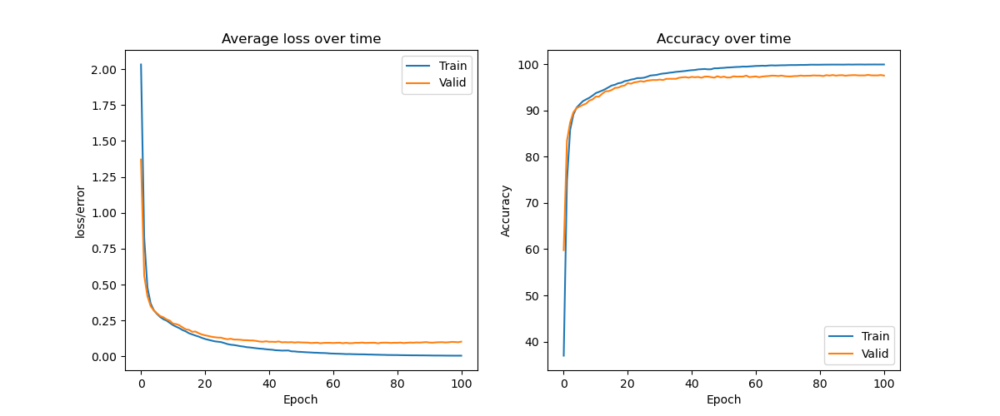

# Zadania
## Damian Wiśniewski

## Zależności

Wszystkie zależności wykorzystane w projekcie znajdują się w pliku `requirements.txt`

Python 3.10

## PyTorch

### Łatwe

#### Zadanie 1 i 2
```
PyTorch/pytorch-easy.ipynb
```

#### Zadanie 3, 4, 5 i 6
```
PyTorch/pytorch-easy-simple-nn.ipynb
```

Training

